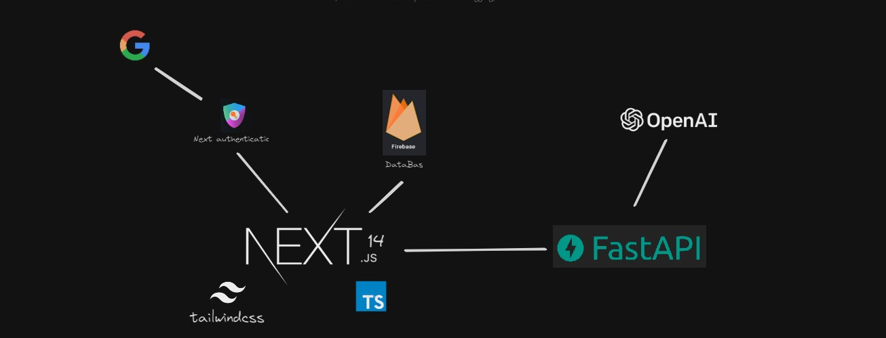
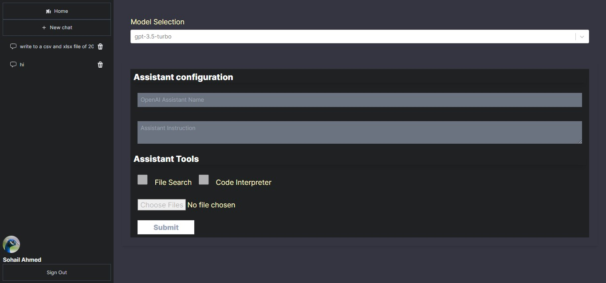
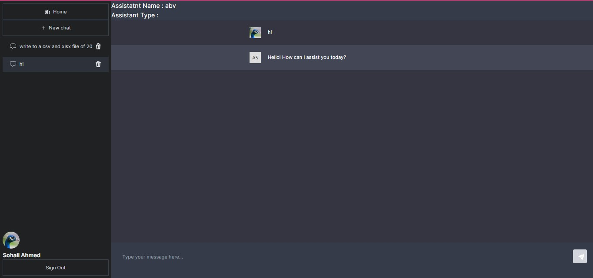
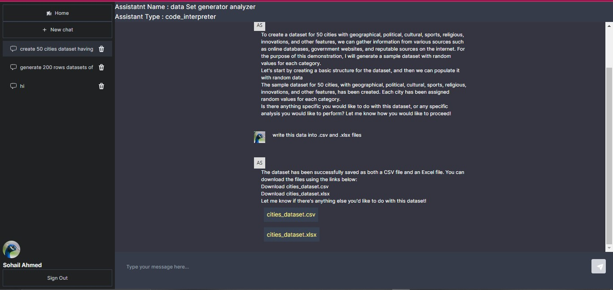
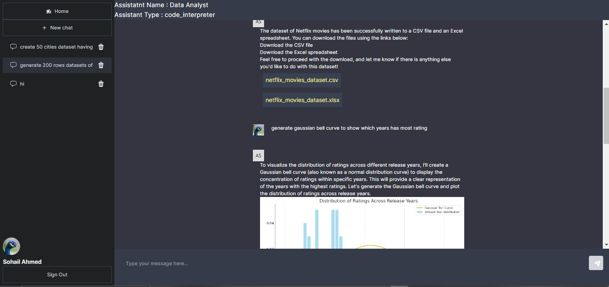

# chatgpt-clone
 A sophisticated chatbot web application utilizing Next.js for the front end and FastAPI for the backend. This backend architecture connects seamlessly with the OpenAI API and Google Firebase for database management.

Each chat session can be customized with different Large Language Models (LLMs), assistant types, and OpenAI tools

The chatbot can generate various types of files and graphical images in response to user queries.
Each chat can utilize user-specific files to enhance responses, providing a more personalized interaction.
 
## 🎉 block diagram

    

## 🎉 chatbot configuration

    

## 🎉 chatbot enviornment

    

## 🎉 code interpreter file generation

    

## 🎉 code interpreter visualization

    

